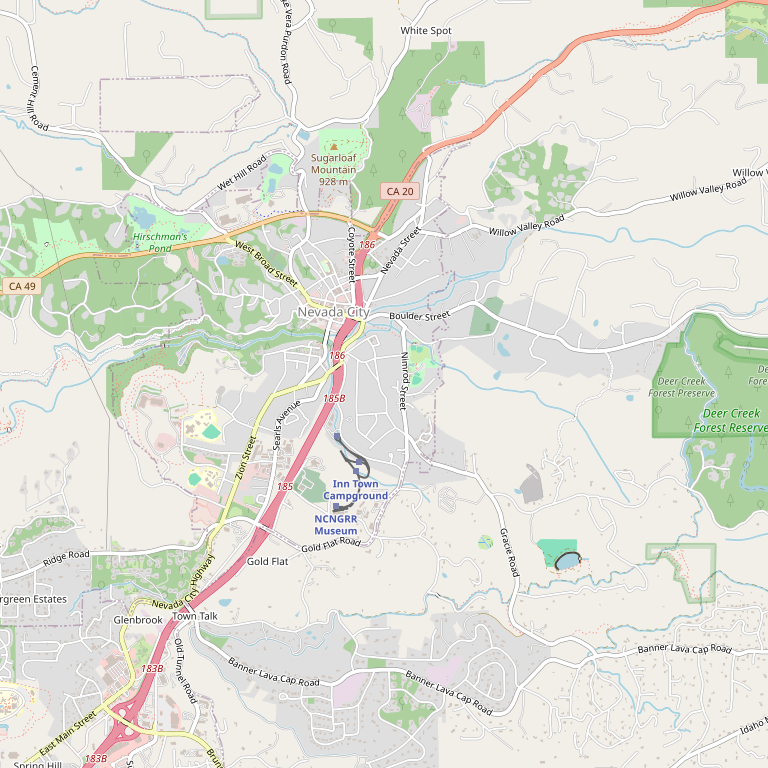

# Nevada City Winery

> *Oldest operating winery in the Sierra Foothills (since 1980)*

## Location

## Overview

| Field | Value |
|-------|-------|
| **Location** | Nevada City, Nevada County |
| **AVA** | Sierra Foothills |
| **Founded** | 1980 |
| **Historic Status** | Oldest operating winery in the region |
| **Portfolio** | 26 wines |
| **Style** | Premium foothills viticulture |
| **Focus** | Diverse varietals |
| **Dog Friendly** | Check |
| **Picnic Area** | Yes |

## Contact

- **Website:** https://www.ncwinery.com
- **Tasting Room:** Daily

## Wines

### Reds
- **Barbera**
- **Merlot**
- **Petite Sirah**
- **Grenache**
- **Cabernet Sauvignon**

### Portfolio
- 26 wines in current portfolio

## History

Nevada City Winery is **the oldest operating winery in the historic Sierra Foothills**, dating back to 1980. This pioneering winery continues to showcase the premium taste of foothill viticulture and the laborious art of fine wines.

## Notes

With 26 wines in its portfolio, Nevada City Winery offers one of the most extensive selections in the region. Essential visiting for understanding the history of Nevada County winemaking.

### The First Modern Vintage
The founder was convinced Nevada County offered the soils and climate to **"make wines that challenge the world's best."** Nevada City Winery made the first modern vintage in 1980 with grapes from the only producing vineyard at that time.

**Pioneer status:** Remains the oldest operating winery in Nevada County, dating back to 1980. The winery helped establish the foundation for the county's wine industry today.

Tastings available daily in downtown Nevada City.

## Visited

- [ ] Have not visited

## Rating

*Not yet rated*

---

*Last updated: 2026-03-21*
