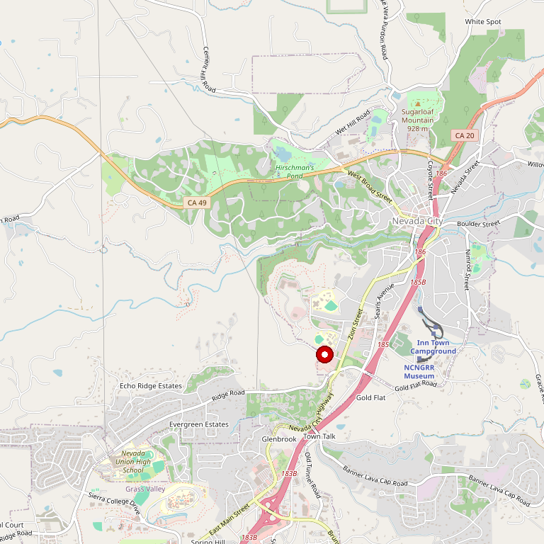

# Sierra Starr Vineyard

> *Downtown Grass Valley tasting room*

## Location

## Overview

| Field | Value |
|-------|-------|
| **Location** | Grass Valley, Nevada County |
| **AVA** | Sierra Foothills |
| **Style** | Estate, boutique |
| **Focus** | Estate wines |
| **Dog Friendly** | Yes |
| **Picnic Area** | Yes |

## Contact

- **Address:** 163 Mill Street, Grass Valley, CA 95945
- **Phone:** (530) 477-8282
- **Website:** https://sierrastarr.com
- **Tasting Room:** Check website for hours

## Wines

### Estate Wines
- Boutique production

## Notes

Part of the downtown Grass Valley wine tasting cluster — steps away from Avanguardia and Lucchesi. Visitors can easily visit all three back to back.

## Visited

- [ ] Have not visited

## Rating

*Not yet rated*

---

*Last updated: 2026-03-21*
