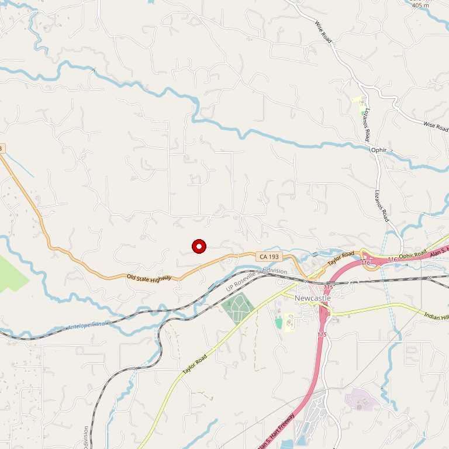

# Dono dal Cielo

> *Zinfandel specialists since 2005*

## Location

## Overview

| Field | Value |
|-------|-------|
| **Location** | Newcastle, Placer County |
| **AVA** | Sierra Foothills |
| **Founded** | 2005 |
| **Style** | Home away from home |
| **Focus** | Zinfandel |
| **Dog Friendly** | Yes |
| **Picnic Area** | Yes |

## Contact

- **Address:** Newcastle (rolling hills area)
- **Website:** https://donodalcielo.com
- **Tasting Room:** Check website for hours

## Wines

### Zinfandel Focus
- Zinfandel specialists since 2005

## Notes

"Dono dal Cielo is your home away from home, nestled in the beautiful rolling hills of Newcastle."

Specializing in **Zinfandel since 2005**, this winery has built a reputation for excellent expressions of California's heritage grape.

## Visited

- [ ] Have not visited

## Rating

*Not yet rated*

---

*Last updated: 2026-03-21*
