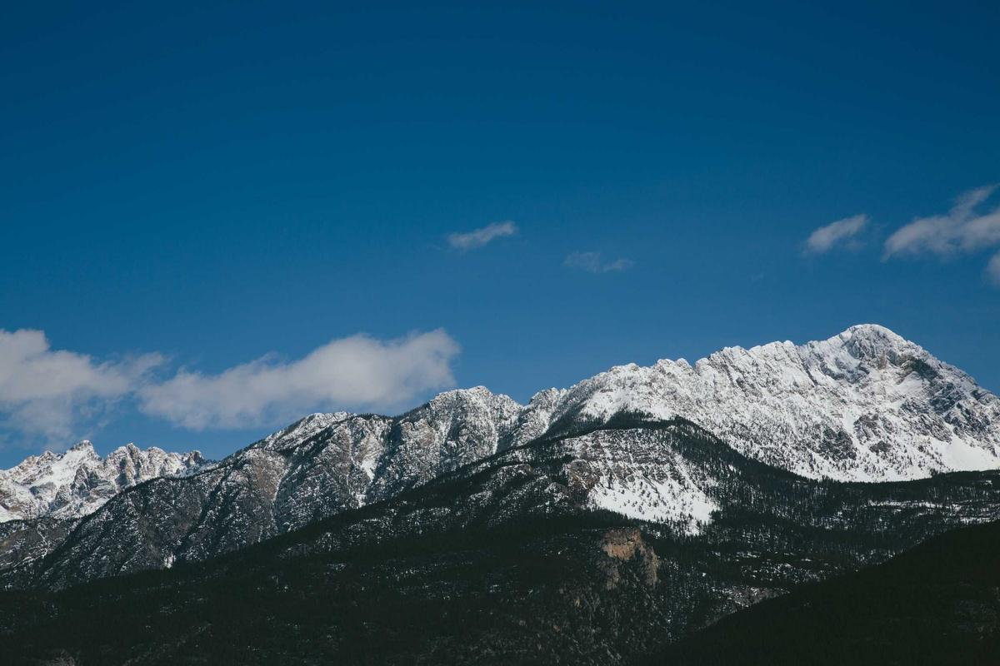

# Dora Dain Wines

> *"Micro micro" winery — Even smaller than boutique*

## Location

## Overview

| Field | Value |
|-------|-------|
| **Location** | Placer County |
| **AVA** | Sierra Foothills |
| **Style** | Micro-production |
| **Focus** | Best possible wines |
| **Dog Friendly** | Yes |
| **Picnic Area** | Yes |

## Contact

- **Website:** https://doradainwines.com
- **Tasting Room:** Check website for hours

## Wines

### Micro-Production
- Extremely limited production
- Family-crafted

## Philosophy

"We are a small family winery embarking on a venture that redefines small wineries. Not even big enough to be 'boutique,' we call ourselves **'micro micro.'**"

"But we're here to make the best wines possible and enjoy every moment of it with our family!"

## Notes

For those seeking truly small-production wines made with personal attention, Dora Dain delivers wines that can't be mass-produced.

## Visited

- [ ] Have not visited

## Rating

*Not yet rated*

---

*Last updated: 2026-03-21*
