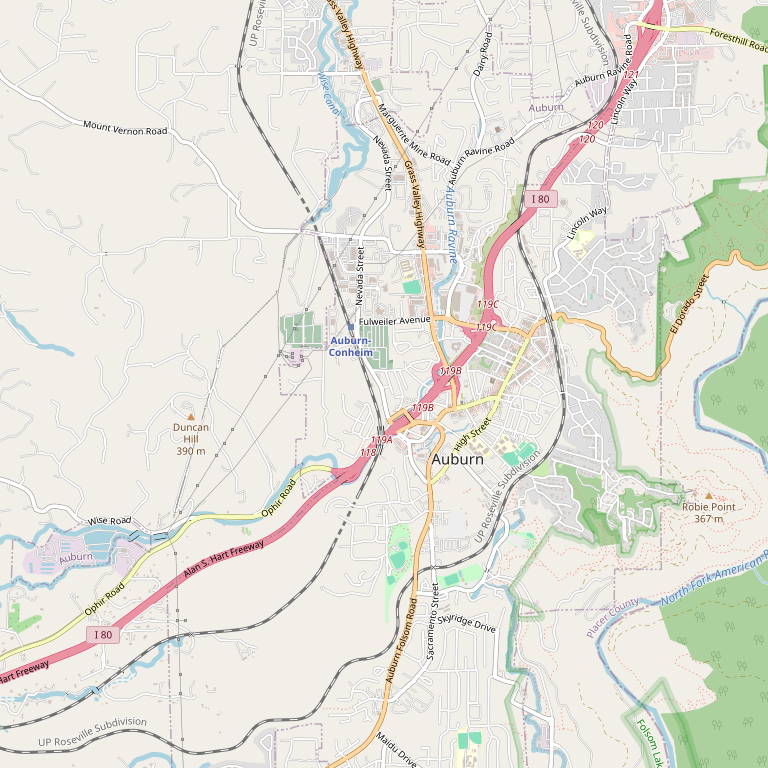

# Lone Buffalo Vineyards

> *"Fit for Cowboys & Kings" — Meet the winemaker*

## Location

## Overview

| Field | Value |
|-------|-------|
| **Location** | Auburn, Placer County |
| **AVA** | Sierra Foothills |
| **Style** | Premium, boutique, hand-crafted |
| **Focus** | Meet-the-winemaker experience |
| **Dog Friendly** | Yes |
| **Picnic Area** | Yes (patio) |

## Contact

- **Address:** Wise Road area, Auburn, CA
- **Website:** https://lonebuffalovineyards.com
- **Tasting Room:** Weekends

## Wines

### Premium Hand-Crafted
- Boutique wines

## Experience

- Meet the winemaker
- View the vineyard from the tasting room
- Enjoy a picnic on the patio

## Notes

Premium, hand-crafted boutique wines served in a rustic-modern tasting room. The setting is described as **"Fit for Cowboys & Kings."**

Small, family-operated winery offering a friendly, educational wine-tasting experience in the laid-back comfort of the countryside.

### 35-Year Passion
**Launched in 2007** by winemaker **Phil Maddux** and wife **Jill** — the culmination of Phil's 35-year passion for winemaking.

**Facilities:** Located on a **12-acre parcel of historic farmland** in North Auburn. The winery boasts over 2,400 sq ft for tasting, production, and storage, plus 1,800 sq ft of crush pad.

**Mission:** Doing its part to return Placer County to its post-Gold Rush roots as a premium wine-producing region.

## Visited

- [ ] Have not visited

## Rating

*Not yet rated*

---

*Last updated: 2026-03-21*
