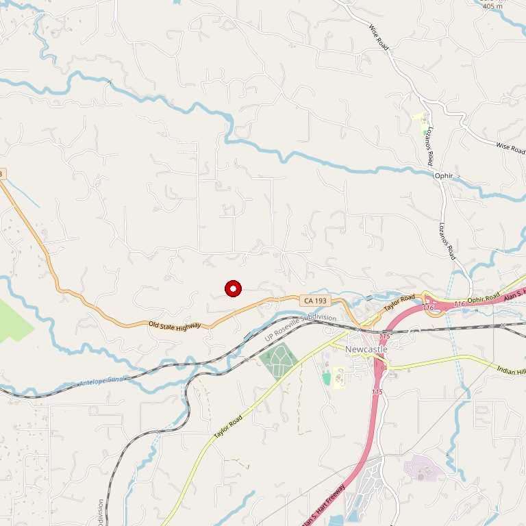

# PaZa Estate Winery

> *"Living with purpose" — Small-lot expressions of passion*

## Location

## Overview

| Field | Value |
|-------|-------|
| **Location** | Placer County |
| **AVA** | Sierra Foothills |
| **Style** | Small-lot, passionate |
| **Focus** | Purpose-driven winemaking |
| **Dog Friendly** | Yes |
| **Picnic Area** | Yes |

## Contact

- **Website:** https://pazawinery.com
- **Tasting Room:** Check website for hours

## Wines

### Small-Lot Wines
- Expressions of passion
- Purpose-driven production

## Philosophy

"PaZa, what does it mean? To us, it's simple — **living with purpose**, and creating expressions of passion one small-lot at a time!"

## Notes

The name and philosophy reflect a commitment to intentional, meaningful winemaking rather than mass production.

## Visited

- [ ] Have not visited

## Rating

*Not yet rated*

---

*Last updated: 2026-03-21*
