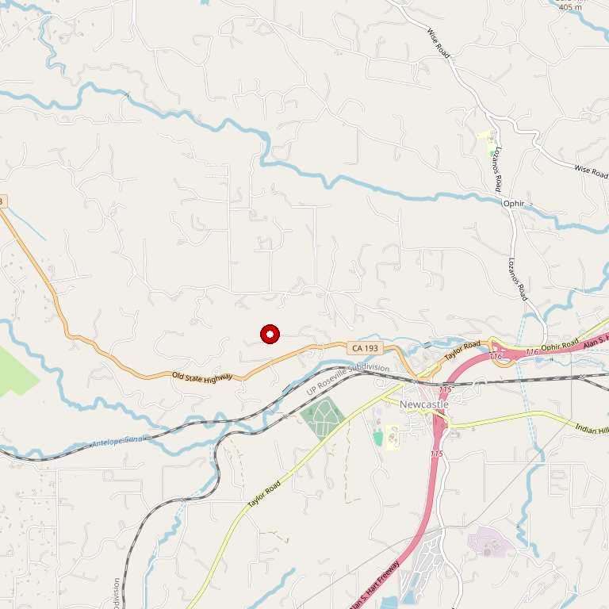

# Secret Ravine Vineyards

> *Family-owned since 1998 with rare Italian varietals*

## Location

## Overview

| Field | Value |
|-------|-------|
| **Location** | Loomis, Placer County |
| **AVA** | Sierra Foothills |
| **Founded** | 1998 |
| **Style** | Family-owned, unique varietals |
| **Focus** | Cabernet Franc, Italian varieties |
| **Dog Friendly** | Yes |
| **Picnic Area** | Yes |

## Contact

- **Address:** Loomis area
- **Website:** https://secretravine.com
- **Tasting Room:** Check website for hours

## Wines

### Reds
- **Cabernet Franc**
- **Montepulciano** — Rare in California
- **Teroldego** — Extremely rare
- **Tannat**
- **Zinfandel**
- Fantastic blends

## History

Secret Ravine Vineyards is a family-owned operation established in **1998**. The winery has built a reputation for unique Italian varietals rarely found in California.

## Notes

The rare Italian varietals (Montepulciano, Teroldego) make Secret Ravine a must-visit for wine adventurers seeking something different.

## Visited

- [ ] Have not visited

## Rating

*Not yet rated*

---

*Last updated: 2026-03-21*
