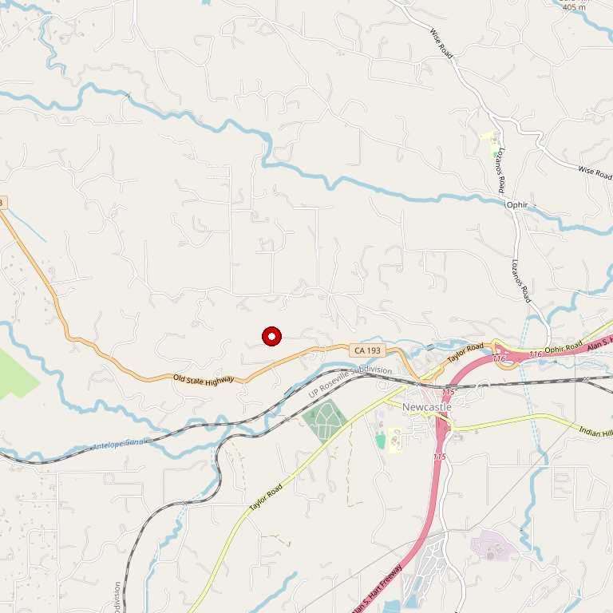

# Wise Villa Winery & Restaurant

> *"Golden State Winery of the Year 2015" with full-service Tuscan bistro*

## Location

## Overview

| Field | Value |
|-------|-------|
| **Location** | Lincoln, Placer County |
| **AVA** | Sierra Foothills |
| **Awards** | Golden State Winery of the Year 2015 |
| **Style** | Tuscan-style, full-service |
| **Focus** | Estate wines, dining |
| **Restaurant** | Yes — Full-service Tuscan bistro |
| **Dog Friendly** | Yes |
| **Picnic Area** | Yes |

## Contact

- **Address:** 4200 Wise Road, Lincoln, CA 95648
- **Website:** https://wisewinery.com
- **Tasting Room:** Check website for hours

## Wines

### Estate Wines
- 12+ varietals
- Award-winning portfolio

## Features

The only winery in Placer County with:
- Full-service Tuscan-style bistro
- Culinary team
- Wine educators
- Professional waitstaff

## History

Named **"Golden State Winery of the Year 2015"**, Wise Villa has established itself as the premier destination winery in Placer County.

## Notes

This is the complete package — wine, food, and service in a Tuscan-inspired setting. Essential visiting for Placer County wine exploration.

## Visited

- [ ] Have not visited

## Rating

*Not yet rated*

---

*Last updated: 2026-03-21*
