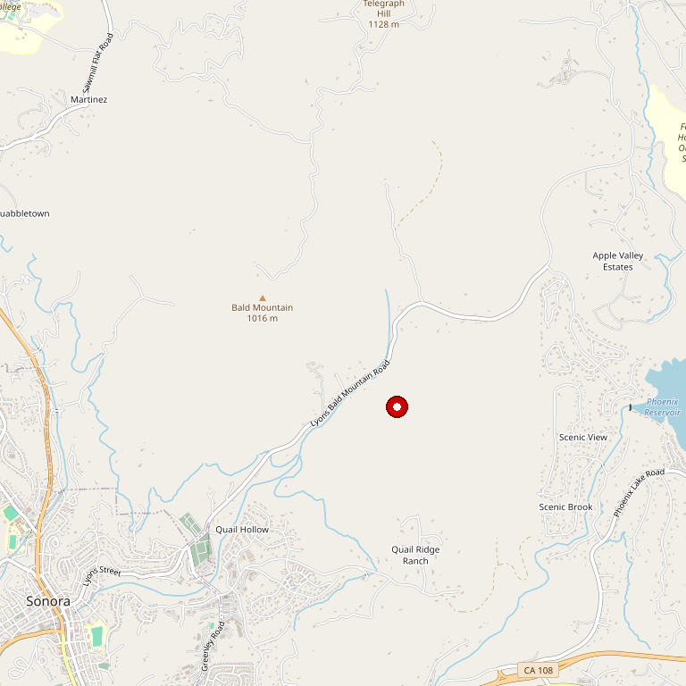

# Inner Sanctum Cellars

> *Limited and premium wines from the foothills*

## Location

## Overview

| Field | Value |
|-------|-------|
| **Location** | Jamestown, Tuolumne County |
| **AVA** | Sierra Foothills |
| **Style** | Limited, premium |
| **Focus** | Limited production premium wines |
| **Dog Friendly** | Yes |
| **Picnic Area** | Yes (patio) |

## Contact

- **Address:** Downtown Jamestown + Basecamp Tap Room
- **Website:** Check local listings
- **Tasting Room:** Thursday 12pm–5pm, Friday–Saturday 12pm–7pm, Sunday 12pm–5pm, Holiday Mondays 12pm–5pm

## Wines

### Premium Wines
- Limited production
- Tuolumne County fruit

## Notes

Inner Sanctum operates a tasting room and patio in downtown Jamestown. The "Basecamp" tap room offers additional tasting options.

From the bountiful foothills of Tuolumne County comes limited and premium wine.

## Visited

- [ ] Have not visited

## Rating

*Not yet rated*

---

*Last updated: 2026-03-21*
