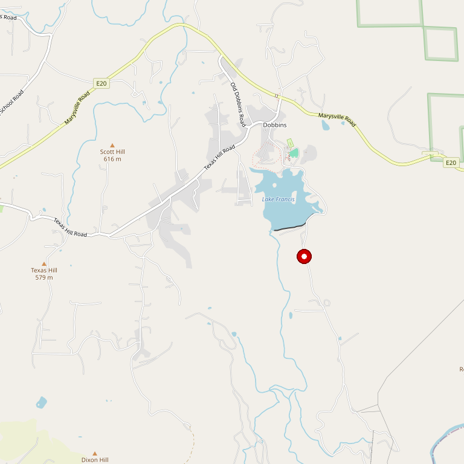

# Clos Saron

> *Natural wines from the Sierra Foothills*

## Location

## Overview

| Field | Value |
|-------|-------|
| **Location** | Yuba County |
| **AVA** | Sierra Foothills |
| **Style** | Natural, minimal intervention |
| **Focus** | Natural wines |
| **Dog Friendly** | Check |
| **Picnic Area** | Check |

## Contact

- **Tasting Room:** By appointment

## Wines

### Natural Wines
- Minimal intervention
- Terroir-focused

## Notes

Clos Saron is known in natural wine circles for producing distinctive, terroir-driven wines with minimal intervention.

## Visited

- [ ] Have not visited

## Rating

*Not yet rated*

---

*Last updated: 2026-03-21*
